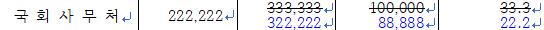
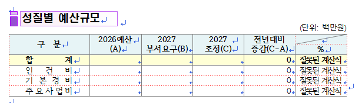
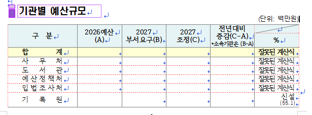
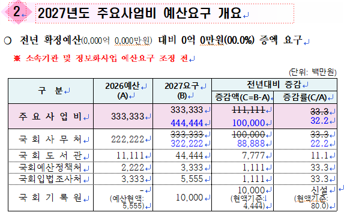
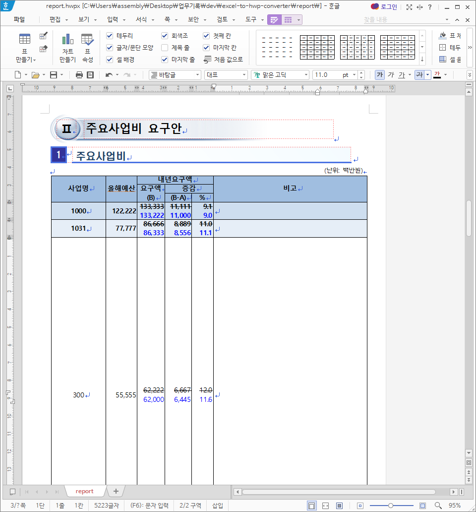
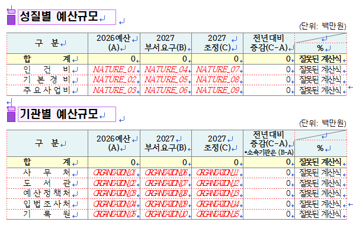
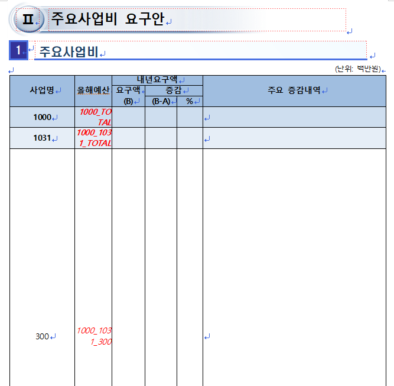

# 엑셀을 한글로

2026년 3월 23일, 원래 사용하고 있는 관리용 엑셀이 있는데 모든 부서의 내용을 취합하다 보니 자주 내용이 바뀌어서 보고서에 수치만 입력하는 반복 작업을 많이 한다고 한다. 엑셀 파일을 바탕으로 특정 서식을 가진 한글 파일에 자동으로 기입되게 할 수 없겠냐는 요청을 받았다. 개발을 시작한 이후로 한글 파일은 처음 건드려보지만 이걸 해내면 매일 야근하시는 주무관님의 업무량이 조금은 줄지 않을까 해서 한 번 도전해보았다.

<br>

엑셀과 한글 파일을 받은 후, 내용을 대강 정리했다.

1. 카테고리는 프로그램/단위사업/세부사업/내역사업/내내역사업으로 이루어져 있다.
    
    ```
    프로그램
    └── 단위사업
        └── 세부사업
            └── 내역사업
                └── 내내역사업
    ```

   - 프로그램은 1000, 2000, 3000..., 7000번까지 있다.
   - 6000번까지는 주요사업비이고, 7000번에는 인건비와 기본경비가 있다.
   - 단위사업은 1031, 1032,.. 2031, ... 7001 등 어떤 규칙인진 모르겠으나 프로그램의 하위 카테고리로 보인다.
   - 세부사업은 300, 301, ...  251, 260 등 어떤 규칙인진 모르겠으나 단위사업의 하위 카테고리로 보인다.
   - 내역사업은 (01), (02)로 이루어져 있는 것도 있고, 그냥 내용만 한글로 적혀있는 경우도 있다. 세부사업의 하위 카테고리로 보인다.
2. 올해예산/내년요구액/검토액을 기준으로 증감액과 증감률을 계산한다.<br>
    <br>
   - 올해예산은 검은색 글씨로 작성한다.
   - 내년요구액은 검은색 글씨로 작성하고, 검토액이 있는 경우에만 취소선 서식을 적용한다.
   - 검토액은 파란색 글씨로 작성하고, 내년요구액에서 줄바꿈하여 작성한다. 검토액만 적는 경우에는 검은색 글씨로 작성한다.
   - 증감액에서는 내년요구액은 검은색 글씨, 취소선 서식을 적용한다.
   - 음수인 경우 △를 숫자 앞에 기입하고, 빨간색 글씨로 작성한다.<br>
3. 상단 개요에는 다음 내용을 기입한다.
   - '성질별 예산규모'에는 기관 상관없이 주요사업비/인건비/기본경비를 모두 합하여 기입한다.<br>
    <br>
   - '기관별 예산규모'에는 주요사업비/인건비/기본경비 구분없이 합한 값을 기관별로 나누어 기입한다.<br>
    <br>
   - '주요사업비 예산요구'에는 인건비/기본경비를 제외한 주요사업비만을 기관별로 나누어 기입한다.<br>
    <br>
4. 본문에는 다음 내용을 기입한다.<br>
   <br>
   - 사무처: 프로그램/단위사업/세부사업까지의 합을 기입한다.
   - 도서관/예산처/입법처/기록원: 프로그램/세부사업/내역사업으로 합을 기입한다. 프로그램의 하위 카테고리인 단위사업은 기입하지 않는다.
   - 인건비와 기본경비는 기관별로 나누어 기입한다.<br>
   
    ```
    # 프로그램
    굵은 글씨

    # 프로그램/단위사업 - 사무처
    굵은 글씨

    # 프로그램/단위사업 - 인건비, 기본경비
    일반 글씨

    # 프로그램/단위사업/세부사업 - 사무처
    일반 글씨

    # 프로그램/단위사업/세부사업 - 사무처 외
    일반 글씨, 요구금액 기입하지 않음

    # 프로그램/단위사업/세부사업 (내용과 합계가 똑같은 경우가 있어 반복문 대신 그냥 2번 적기로 함)
    굵은 글씨, 요구금액 기입하지 않음

    # 프로그램/단위사업/세부사업/내역사업
    일반 글씨, 요구금액 기입하지 않음
    ```

조건은 이걸로 끝이다.
<br><br>

엑셀은 그렇다쳐도, 한글 파일의 정해진 위치에 값을 채워넣는 게 가능한지 몰라서 AI랑 대화를 좀 해보니 '누름틀'이라는 기능이 한글에 있다고 한다. 처음부터 서식을 하나하나 그리기에는 거대 작업이 될 것 같아 기존 틀은 그대로 두고, 누름틀을 적극 활용하기로 했다.<br>
<br>

<br>
템플릿으로 사용할 '양식파일.hwpx'을 만들었다. 양식파일은 총 24페이지 정도로, 직접 필요한 위치에 누름틀을 생성하여 이름을 연결한다.<br>
<br>

<br><br>
파이썬의 패키지 중 pyhwpx라는 게 있는데, 한글 파일을 컨트롤할 수 있는 기능이 꽤 있었다.
일단 이 프로젝트에 필요한 기능은 아래와 같다.
- 한글 파일을 열고 수치를 입력
- 입력한 수치에다가 정해진 서식 추가
- 다른 이름으로 저장
pyhwpx 공식문서는 [여기](https://martiniifun.github.io/pyhwpx/) 에서 볼 수 있다.

<br>

기본적으로 필요한 파일은 이렇다.
```
.
├── converter.py (핵심 스크립트)
├── constants.py (상수)
├── 양식파일.hwpx (템플릿)
└── 예산.xlsx (엑셀 파일)
```

<br><br>

내 자리 컴퓨터의 환경은 window이고, 주로 사용하는 브라우저는 microsoft edge이다.

<details>
<summary>converter.py</summary>

```
import os
import sys
import glob
import shutil
import logging
import traceback
import pandas as pd
from pyhwpx import Hwp
from datetime import datetime
import constants as c
from tkinter import messagebox, Tk

##################################################### debug
logger = logging.getLogger(__name__)
logger.setLevel(logging.INFO)
stream_handler = logging.StreamHandler()
stream_handler.setFormatter(logging.Formatter('%(message)s'))
logger.addHandler(stream_handler)

def save_error_log():
  file_handler = logging.FileHandler("debug_log.txt", encoding='utf-8')
  formatter = logging.Formatter('%(asctime)s - %(levelname)s - %(message)s')
  file_handler.setFormatter(formatter)
  logger.addHandler(file_handler)
  
  logger.error("Detailed traceback information:")
  logger.error(traceback.format_exc())
  
  file_handler.flush()
  logger.removeHandler(file_handler)


##################################################### utils
# error message
def show_alert(title, message):
  root = Tk()
  root.withdraw()
  messagebox.showinfo(title, message)
  root.destroy()

# date converter
def get_formatted_date():
  now = datetime.now()
  date_text = f"{now.strftime('%y')}. {now.month}."
  print(f"[WITTEN] {date_text}")
  return date_text

# ratio converter
def to_ratio(val):
  if pd.isna(val) or val == 0: return "-"
  return f"{'△' if val < 0 else ''}{abs(val):.1f}"

# comma
def to_thousands(val):
  try:
    num = float(str(val).replace(',', '').strip())
    if num == 0: return "-"
    formatted = f"{int(abs(num) / 1000):,}"
    return f"△{formatted}" if num < 0 else formatted
  except (ValueError, TypeError):
    return "-"

# growth rate calculator
def growth_rate(target, now):
  if not now or not target: return 0.0
  return round((target - now) / now * 100, 1)

# progress bar
def update_progress(writer, field_name=''): 
  bar_length=20
  percent = (writer.current_count / writer.total_tasks)
  filled_length = int(bar_length * percent)
  bar = "■" * filled_length + "□" * (bar_length - filled_length)
  clean_name = str(field_name).strip()
  display_name = (clean_name[:22] + '..') if len(clean_name) > 24 else clean_name
  print(f"\r{bar} {int(percent * 100):>3}% ({writer.current_count}/{writer.total_tasks}) {display_name:<30}", end="", flush=True)

# path
def get_paths():
  if getattr(sys, 'frozen', False):
    current_dir = os.path.dirname(os.path.abspath(sys.executable)) # exe
  else:
    current_dir = os.path.dirname(os.path.abspath(__file__)) # script

  # found excel file
  excel_files = glob.glob(os.path.join(current_dir, "*.xlsx"))
  excel_files = [f for f in excel_files if not os.path.basename(f).startswith("~$")]
  if not excel_files:
    show_alert("Error", f"No Excel (.xlsx) file was found in the specified folder.")
  selected_excel = excel_files[0]

  # found template file
  template_path = os.path.join(current_dir, c.TEMPLATE_FILE)
  if not os.path.exists(template_path):
    show_alert("Error", f"No template (.hwpx) file was found in the specified folder.")
  
  return {
    "excel": selected_excel,
    "template": os.path.join(current_dir, c.TEMPLATE_FILE),
    "output": os.path.join(current_dir, f"{datetime.now().strftime('%Y-%m-%d-%H%M%S')}.hwp")
  }

##################################################### hwp
class HwpWriter:
  def __init__(self, output_path):
    try:
      print(f"[INIT] Opening HWP file: {os.path.basename(output_path)}")
      self.hwp = Hwp()
      self.hwp.open(output_path)
      self.budget_storage = {}
      self.total_tasks = 0
      self.current_count = 0
    except Exception as e:
      print(f"[ERROR] Opening HWP file: {e}")
      save_error_log()
      raise

  # ui
  def apply_cell_style(self, req_txt, fix_txt, req_num, fix_num, is_bold=False):
    # initialize
    self.hwp.SelectAll() 
    self.hwp.Delete()
    self.hwp.set_font(StrikeOutType=False, Bold=False, TextColor="Black")

    # single-line
    if fix_txt is None:
      self.hwp.insert_text(str(req_txt or "0"))
      self.hwp.MoveLineBegin(); self.hwp.MoveSelLineEnd()
      req_color = "Red" if (req_num and req_num < 0) else "Black"
      self.hwp.set_font(TextColor=req_color, Bold=is_bold)
    
    # multi-line
    else:
      self.hwp.insert_text(f"{req_txt or '-'}\r\n{fix_txt or '-'}")
      self.hwp.MoveLineBegin(); self.hwp.MoveUp(); self.hwp.MoveLineBegin(); self.hwp.MoveSelLineEnd()
      self.hwp.set_font(StrikeOutType=True, StrikeOutShape=0, Bold=is_bold) 
      self.hwp.MoveDown(); self.hwp.MoveLineBegin(); self.hwp.MoveSelLineEnd()
      self.hwp.set_font(TextColor="Red" if (fix_num and fix_num < 0) else "Blue", Bold=is_bold)
    self.hwp.Cancel()

  # found '누름틀'
  def write_budget_cell(self, field, data, is_bold=False, is_single_line=False):
    if not self.hwp.field_exist(field): 
      print(f"\n[WARN] Field not found: {field}")
      return

    try:
      self.budget_storage[field] = data['now']
      self.hwp.move_to_field(field)
      steps = [
        (data['now'], None),
        (data['req'], None if is_single_line else data['fix']),
        (data['req']-data['now'], None if is_single_line else data['fix']-data['now']),
        (growth_rate(data['req'], data['now']), None if is_single_line else growth_rate(data['fix'], data['now']))
      ]

      # entered value
      for i, (req_val, fix_val) in enumerate(steps):
        is_ratio = (i == 3)
        req_txt = to_ratio(req_val) if is_ratio else to_thousands(req_val)
        fix_txt = (to_ratio(fix_val) if is_ratio else to_thousands(fix_val)) if fix_val is not None else None
        self.apply_cell_style(req_txt, fix_txt, req_val, fix_val or 0, is_bold)
        if i < len(steps) - 1: self.hwp.TableRightCell()
    except Exception as e:
      print(f"\n[ERROR] Writing failed at [{field}]: {e}")
      save_error_log()
  

##################################################### excel
def load_excel(file_path):
  df = pd.read_excel(file_path, header=None)
  df_detail = pd.read_excel(file_path, header=11)

  target_cols = [df_detail.columns[c.COL_NOW], df_detail.columns[c.COL_REQ], df_detail.columns[c.COL_FIX]]
  for col in target_cols:
    df_detail[col] = pd.to_numeric(df_detail[col].astype(str).str.replace(',', ''), errors='coerce').fillna(0)

  has_code = df_detail.iloc[:, c.COL_PROG].astype(str).str.contains(r'^\[\d+\]') | \
               df_detail.iloc[:, c.COL_UNIT].astype(str).str.contains(r'^\[\d+\]') | \
               df_detail.iloc[:, c.COL_SUB].astype(str).str.contains(r'^\[\d+\]')
    
  is_header_row = df_detail.iloc[:, c.COL_DETAIL].isna() & has_code
  df_detail.iloc[:, [c.COL_PROG, c.COL_UNIT, c.COL_SUB]] = df_detail.iloc[:, [c.COL_PROG, c.COL_UNIT, c.COL_SUB]].ffill()
  df_sums = df_detail[is_header_row].copy()
  
  return df, df_detail, df_sums

##################################################### boilerplate
def match_field(writer, df, mapping, col_indices, is_bold=False, is_single_line=False):
  
  for idx, (keys, field) in enumerate(mapping.items(), 1):
    writer.current_count += 1
    update_progress(writer, field)
  
    # map excel keys to hwp field
    key_list = list(keys) if isinstance(keys, tuple) else [keys]
    cond = True
    for i, key in enumerate(key_list):
      if key is not None:
        cond &= (df.iloc[:, col_indices[i]] == key)
    
    # calculate budget values
    rows = df[cond]
    if not rows.empty:
      now = rows.iloc[:, c.COL_NOW].sum()
      req = rows.iloc[:, c.COL_REQ].sum()
      fix = rows.iloc[:, c.COL_FIX].sum()
      metrics = {"now": now, "req": req, "fix": fix}
      writer.write_budget_cell(
        field, 
        metrics, 
        is_bold=is_bold, 
        is_single_line=is_single_line or (req == fix)
      )
    else:
      print(f"\n[MISS] No match found for: {keys} -> Field: {field}")
  

##################################################### core
def fill_summary(writer, df, df_sums):
  # nature (개요 - 성질별 예산규모)
  nature_vals = df.iloc[c.NATURE_ROWS_NR, c.NATURE_COL_NOW].tolist() + \
                df.iloc[c.NATURE_ROWS_NR, c.NATURE_COL_REQ].tolist() + \
                df.iloc[c.NATURE_ROWS_F, c.NATURE_COL_FIX].tolist()
  for field, val in zip(c.SUM_BY_NATURE, nature_vals):
    writer.current_count += 1
    if writer.hwp.field_exist(field):
      update_progress(writer, field)
      writer.hwp.move_to_field(field)
      writer.apply_cell_style(to_thousands(val), None, val, None, False)

  # organization (개요 - 기관별 예산규모 올해 예산)
  for field, target_fields in c.SUM_BY_ORGANIZATION_1.items():
    if not writer.hwp.field_exist(field): continue
    writer.current_count += 1
    update_progress(writer, field)
    total_fix = sum(writer.budget_storage.get(f, 0) for f in target_fields)
    writer.hwp.move_to_field(field)
    writer.apply_cell_style(to_thousands(total_fix), None, total_fix, None, is_bold=False)

  # organization (개요 - 기관별 예산규모 내년요구, 검토)
  org_vals = df.iloc[c.ORG_ROW, c.ORG_COLS_REQ].tolist() + df.iloc[c.ORG_ROW, c.ORG_COLS_FIX].tolist()
  for field, val in zip(c.SUM_BY_ORGANIZATION_2, org_vals):
    if writer.hwp.field_exist(field):
      writer.current_count += 1
      update_progress(writer, field)
      writer.hwp.move_to_field(field)
      writer.apply_cell_style(to_thousands(val), None, val, None, False)
  
  # project (개요 - 주요사업비 예산요구)
  cols = [c.COL_NOW, c.COL_REQ, c.COL_FIX]
  for col_idx in cols:
    df_sums.iloc[:, col_idx] = pd.to_numeric(df_sums.iloc[:, col_idx], errors='coerce').fillna(0)
  
  actual_progs = df_sums.iloc[:, c.COL_PROG].astype(str).str.strip()
  total_metrics = {"now": 0, "req": 0, "fix": 0}

  for field, target_prog_names in c.SUM_PROJECT.items():
    now, req, fix = 0, 0, 0
    for prog_name in target_prog_names:
      target = str(prog_name).strip()
      prog_rows = df_sums[actual_progs == target]
      
      if not prog_rows.empty:
        now += prog_rows.iloc[:, c.COL_NOW].sum()
        req += prog_rows.iloc[:, c.COL_REQ].sum()
        fix += prog_rows.iloc[:, c.COL_FIX].sum()

    metrics = {"now": now, "req": req, "fix": fix}
    writer.current_count += 1
    update_progress(writer, field)
    writer.write_budget_cell(field, metrics, is_bold=False, is_single_line=True)

    total_metrics["now"] += now
    total_metrics["req"] += req
    total_metrics["fix"] += fix
  
  # write grand total
  if c.SUM_PROJECT_TOTAL:
    writer.current_count += 1
    update_progress(writer, c.SUM_PROJECT_TOTAL)
    writer.write_budget_cell(c.SUM_PROJECT_TOTAL, total_metrics, is_bold=True, is_single_line=True)


def generate_hwp():
  try:
    print("[START] Beginning HWP generation process")
    paths = get_paths()

    print(f"[COPY] Creating output file: {os.path.basename(paths['output'])}")
    shutil.copy(paths['template'], paths['output'])

    # road
    print("[LOAD] Reading Excel data...")
    df, df_detail, df_sums = load_excel(paths['excel'])
    writer = HwpWriter(paths['output'])

    # update report date
    date_str = get_formatted_date()
    if writer.hwp.field_exist(c.WRITTEN): writer.hwp.put_field_text(c.WRITTEN, date_str)

    # progress
    all_mappings = [
      c.ASSOCIATED_SUB_PROJECTS, c.UNITS, c.PROGRAMS,
      c.ASSOCIATED_DETAILS, c.ASSOCIATED_SUB_UNITS, 
      c.SUB_PROJECTS, c.TOTAL_UNITS
    ]
    summary_tasks_count = (
        len(c.SUM_BY_NATURE) + 
        len(c.SUM_BY_ORGANIZATION_1) + 
        len(c.SUM_BY_ORGANIZATION_2) + 
        len(c.SUM_PROJECT) + 
        (1 if c.SUM_PROJECT_TOTAL else 0)
    )
    writer.total_tasks = sum(len(m) for m in all_mappings) + summary_tasks_count

    # filling fields
    print(f"[RUN] Matching fields and filling data...")
    # 본문
    match_field(writer, df_sums, c.ASSOCIATED_SUB_PROJECTS, [c.COL_PROG, c.COL_UNIT, c.COL_SUB], is_bold=True, is_single_line=True)
    match_field(writer, df_sums, c.UNITS, [c.COL_PROG, c.COL_UNIT], is_bold=True)
    match_field(writer, df_sums, c.PROGRAMS, [c.COL_PROG], is_bold=True)
    match_field(writer, df_detail, c.ASSOCIATED_DETAILS, [c.COL_PROG, c.COL_UNIT, c.COL_SUB, c.COL_DETAIL], is_single_line=True)
    match_field(writer, df_sums, c.ASSOCIATED_SUB_UNITS, [c.COL_PROG, c.COL_UNIT, c.COL_SUB], is_single_line=True)
    match_field(writer, df_sums, c.SUB_PROJECTS, [c.COL_PROG, c.COL_UNIT, c.COL_SUB])
    match_field(writer, df_sums, c.TOTAL_UNITS, [c.COL_PROG, c.COL_UNIT])

    # 개요
    fill_summary(writer, df, df_sums)
    
    # save
    writer.hwp.save()

  except Exception as e:
    print(f"\n[Error] Process halted due to error: {e}")
    save_error_log()
    show_alert("Error", f"Process halted due to error")

  finally:
    print("\n[EXIT] Program terminated.")

if __name__ == "__main__":
    generate_hwp()
```

</details>

<br>

위 코드는 다음 명령어로 간단하게 실행시킬 수 있다.

```
py converter.py
```

<br><br>

평소 업무에 사용하는 특정 엑셀 파일을 converter.py와 같은 폴더 안의 같은 선상에 둔다.

1. 실행시키면 TARGET_URL로 자동으로 한글 파일이 열리면서 기입된다.
2. 잠시 기다린다.
3. 완료되면 같은 폴더 내에 파일이 저장된다. (파일 이름은 YYmmmddd-HHMMSS.hwp)

<br><br>

덧붙이는 글.<br>

서식이 꽤 복잡해서 처음엔 조금 애먹었다. 최대한 constants.py를 간결하게 작성하고 싶었는데.. 엑셀에 적혀있는 카테고리 이름이 언제나 같은 건 아닌 듯 해서 어떻게 사용하시는지 한 번 파악한 후 추가로 수정해야겠다고 결론내렸다. 그리고 실행 스크립트를 처음엔 bat 파일로 만들었으나 python 설치가 되어 있는 컴퓨터에서만 사용할 수 있는 건지 몰랐다. 해서, exe 파일로 다시 생성하여 파일을 전달했다.
```
pip install pyinstaller
pyinstaller converter.py --onefile --noconsole
```
피드백을 들었는데, 촤라라락 입력되는 과정이 아주 폭력적이라는 코멘트를 남겨주셨다.