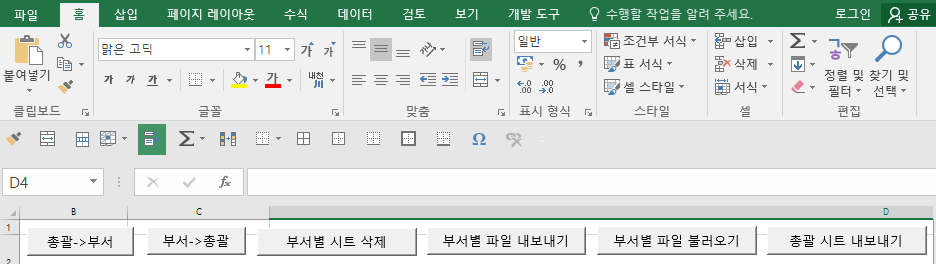
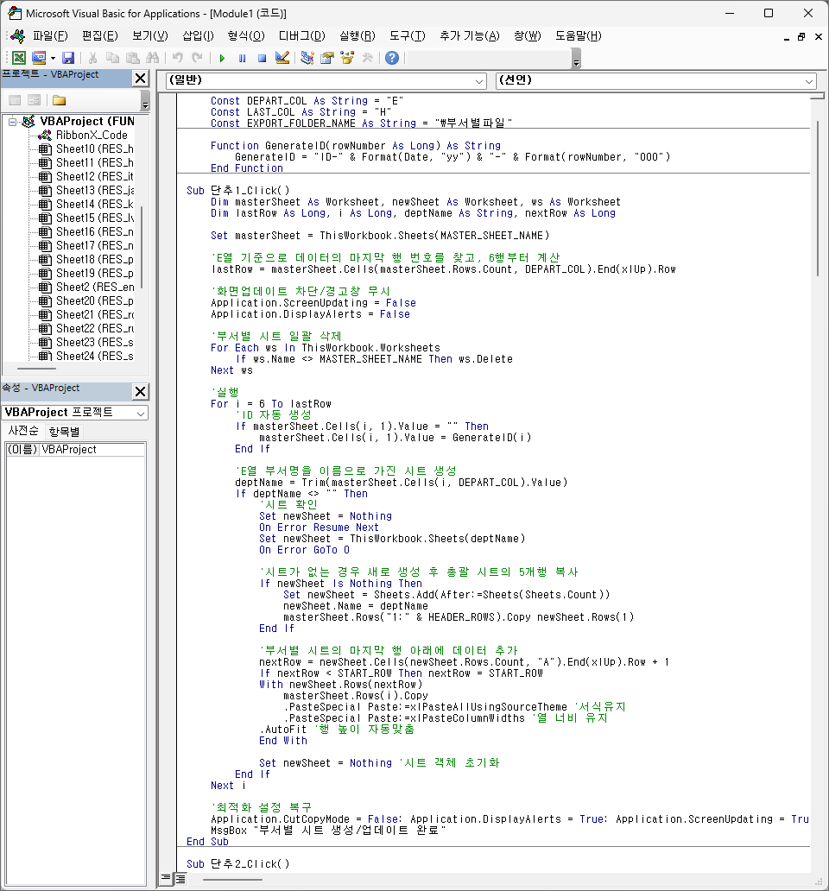
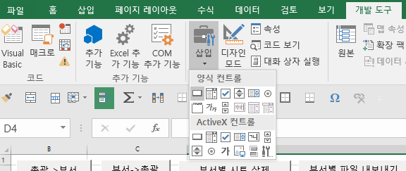
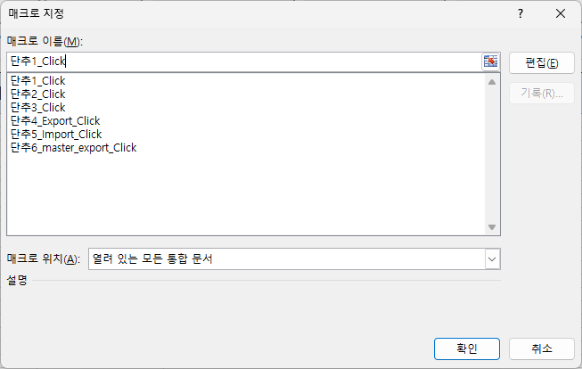

# 엑셀 시트 분할 및 취합 자동화

2026년 6월 9일, 엑셀에서 총괄 시트에 적은 내용을 부서별 탭에 자동으로 동기화시킬 순 없겠냐는 요청이 있었다. 처음 들었을 땐, 피벗테이블을 사용하면 어떨까 생각했었는데 알아보니까 피벗테이블은 단방향이라 부서별 시트에서 내용을 수정할 수 없다고 한다. 엑셀에는 VBA라고 microsoft 프로그램 내에서 작동하는 프로그래밍 언어가 있다. 다른 방법이 없는 듯 해서 VBA를 사용하기로 결정했다.

일주일 정도 뒤에 추가 요청이 들어왔다. 버튼은 안보이게 하되, 버튼의 기능을 살려줄 순 없겠냐고 하셨다. 버튼 자체가 VBA와 직접 연동되어 있어 제거하면 기능도 작동하지 않는다고 설명했다.<br>
원하는 내용이 무엇인지 찬찬히 들어보니, 각 부서의 담당자에게 파일을 보내는데 해당하는 부서 시트만 버튼을 제거하고 파일로 내보내기해서 보낸다는 거였다. 그래서 대안으로 버튼을 제거해서 파일 내보내기까지 한 번에 되는 기능을 만들어드리면 어떻겠냐고 제안했고, 더 반가워하셨다.<br>
그리고 다시 각 부서에서 온 파일을 총괄 파일로 자동으로 취합되었으면 좋겠다고 했다.

다음날에 추가 요청이 들어왔다. 총괄 시트를 버튼 없이 파일로 내보내고 싶다고 했다.
<br>
이 글은 모든 작업을 끝낸 후 종합하여 작성했다.

<br><br>

**주요 요구사항**을 정리해보자면 다음과 같다.

- 총괄 시트에 적은 내용을 해당하는 부서 시트로 분배
- 부서별 시트에 내용을 추가하거나 수정하면 총괄 시트에 자동 반영
- 총괄 시트에서 내용을 추가하거나 수정하면 부서별 시트에 자동 반영
- 부서별 시트를 버튼 없이 파일로 내보내기
- 각 부서의 담당자에게 받은 파일을 총괄 시트가 있는 파일의 탭으로 취합 & 내용을 총괄 시트에도 반영
- 총괄 시트를 버튼 없이 파일로 내보내기

**정해지지 않은 내용**은 대략 이렇다.

- 부서는 아직 미정으로, 부서 파일을 미리 만들어둘 수 없다. 어림잡아 20개는 넘고, 계속 추가될 수도 있다고 한다.
- 얼마나 지속될 프로젝트인지 모른다. 따라서 데이터 양을 예측할 수 없다.

<br><br>

VBA는 나도 처음이라 실시간 동기화는 일단 배제하고 버튼으로나마 동작할 수 있게 만들어보았다.<br>

다음의 기능을 만들기로 했다.<br>
<br>

```
- 총괄 -> 부서
- 부서 -> 총괄
- 부서별 시트 삭제
- 부서별 시트를 파일로 내보내기
- 부서별 파일을 시트로 불러오기
- 총괄 시트 내보내기
```

- 총괄 -> 부서 : 총괄 시트에 있는 내용을 '부서' 컬럼을 기준으로 부서별 시트로 나눈다.
- 부서 -> 총괄 : 부서별 시트 모두에서 모든 내용을 모아 총괄 시트로 가져온다.
- 부서별 시트 삭제 : 총괄 시트를 제외하고 모든 시트를 삭제한다.
- 부서별 시트를 파일로 내보내기 : 만들어진 모든 부서별 시트에서 버튼을 삭제하고 새로운 폴더를 생성하여 부서명으로 내보낸다.
- 부서별 파일을 시트로 불러오기 : 만들어졌던 폴더에 수동으로 파일을 덮어씌우면, 파일의 이름과 시트의 이름을 비교하여 내용을 덮어씌운다.
- 총괄 시트 내보내기 : 총괄 시트만 버튼을 제거하여 파일로 내보낸다.

<br><br>

VBA를 사용하려면 처음에 어느 정도의 설정이 필요하다.
- 상단 메뉴에서 마우스 오른쪽 버튼을 눌러 [리본 메뉴 사용자 지정]에서 개발도구 탭을 활성화해야 한다.
- .xlsx이 아닌 .xlsm으로 저장해야 코드가 사라지지 않는다.
- VBA 코드가 포함된 파일을 사용하려면 [모든 매크로 포함(위험성 때문에 권장하지않음)]을 승인해야 사용할 수 있다.
Alt + F11을 누르면 VBA 편집기를 사용할 수 있다.

1. VBA 편집기에 코드를 입력한다.<br>
   <br>
   
2. 함수와 연결할 버튼을 만든다.<br>
   <br>
   
3. 버튼에서 오른쪽 마우스로 클릭해 메뉴에서 매크로 지정을 누른다. 이후 나타난 창에서 원하는 기능의 함수와 연결한다.<br>
   <br>

<br><br>

가장 큰 고민은 데이터 흐름을 어떻게 정하냐인데, 아무래도 양방향이다보니 생성과 수정, 삭제가 가장 신경이 쓰였다. 데이터 충돌을 방지하기 위해 총괄 시트 기준으로 덮어쓰기로 했는데, 나쁘지 않았던 것 같다.
- '총괄 -> 부서'에선 부서별 시트 내용을 초기화한 후, 총괄 시트의 데이터를 기반으로 부서별 시트를 새로 생성한다.
- '부서 -> 총괄'에선 부서별 시트에서 추가되거나 수정된 내용의 ID를 추적하여 업데이트 한다.<br>
ID는 관리를 위한 것으로 사용자에겐 필요없는 데이터이기 때문에 해당 데이터가 위치한 컬럼인 A열을 숨기기 처리하고, 흰색 글씨로 설정했다.

<br><br>

덧붙이는 글.<br>
비개발 직군인 사용자가 직관적으로 사용할 수 있도록 화면의 구성을 많이 고민했다. 폼이라는 단어조차 낯설어하는 사용자를 위해 최대한 기능을 단순하게 풀어내는 집중했고, 덕분에 파일을 전달하고서 추가 설명 없이도 바로 어떻게 사용하는지 알겠다는 피드백을 들었다.