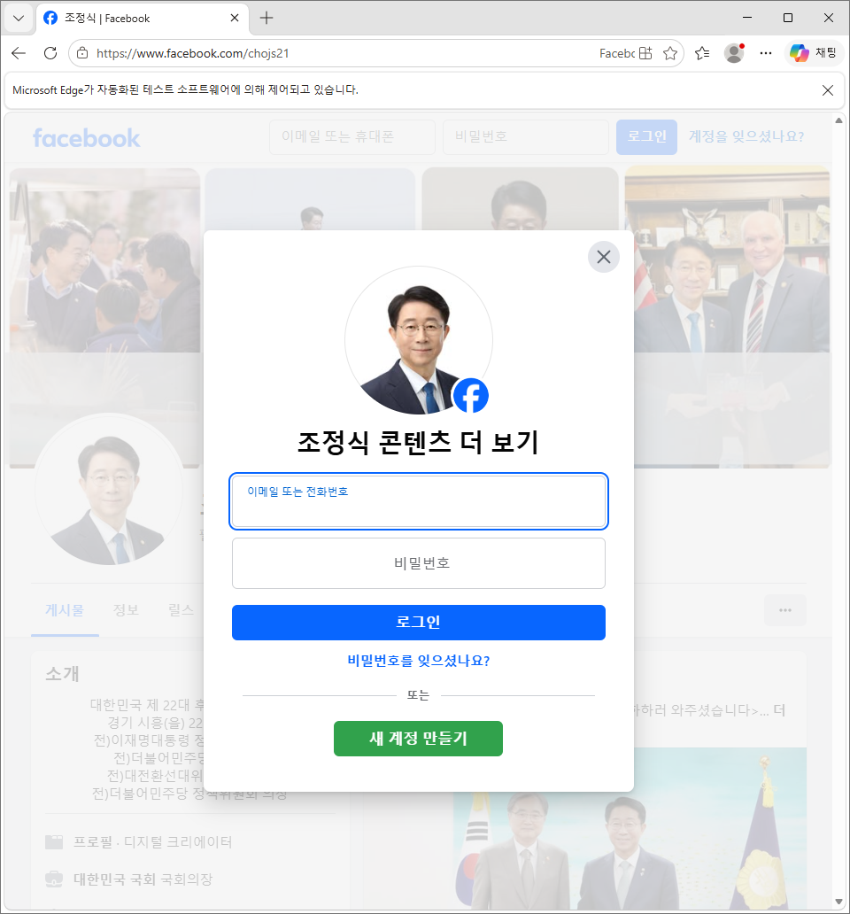
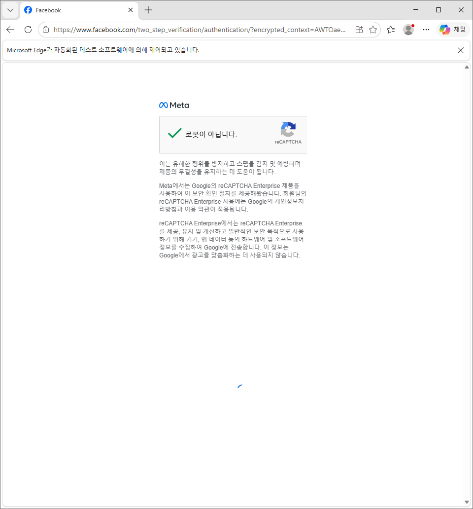
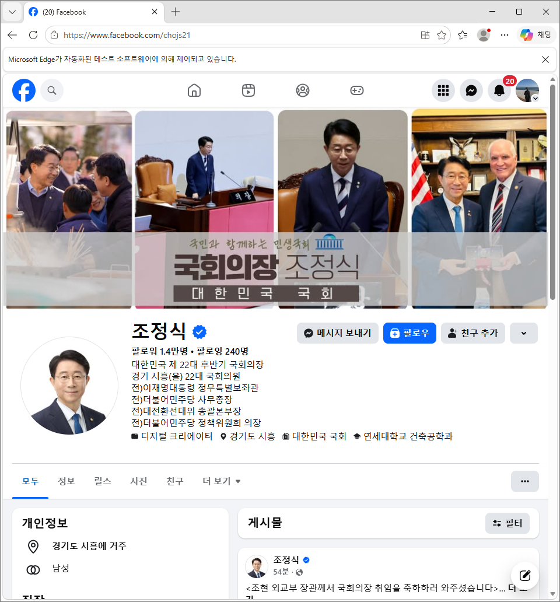
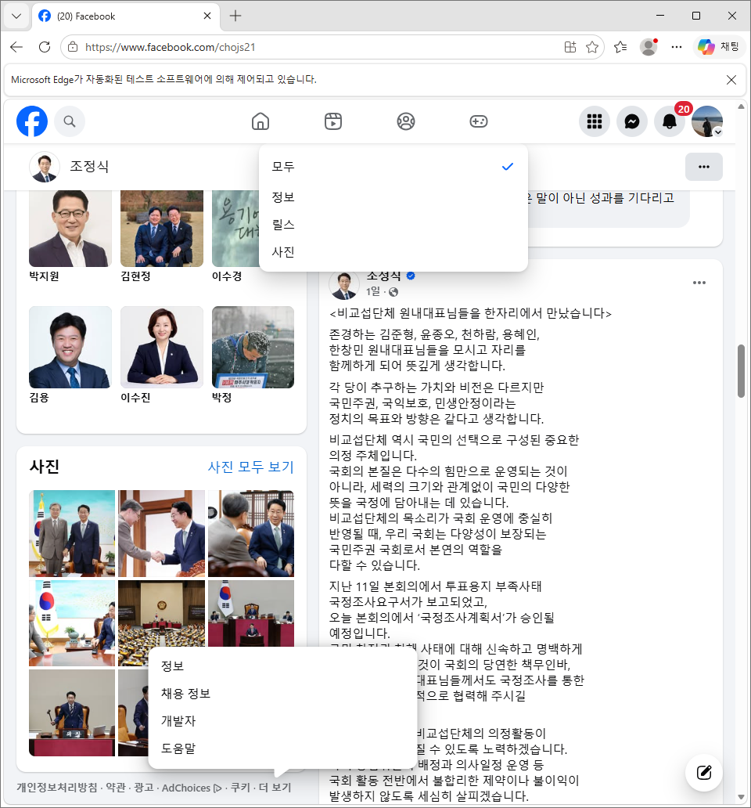
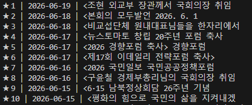
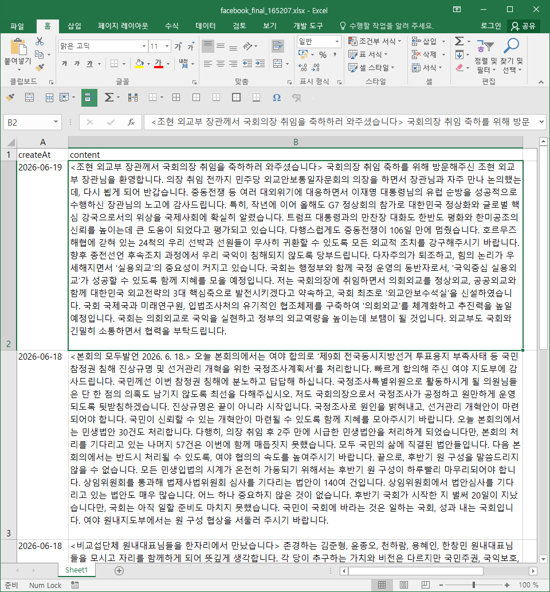

# 3년치 페이스북 게시물 수집기

2026년 3월 20일, 특정 인물 2명의 페이스북 게시글을 수집해달라는 요청을 받았다. 3일 정도의 기간이 있었는데 3년치... 그래서 페이스북으로 들어가 확인해봤는데 어... 하루에도 2~5개씩 글을 올렸다는 사실과 마주하게 되었다. 주말도 예외없었다.
최소 2개씩 올렸다고 가정한다면 3개 x 365일 x 3년 = 2190개.
2명이니까 난 적어도 4300개 가량의 글을 복사 붙여넣기해야 하는 것이다. 시간 내에 끝낼 수 있을지는 고사하고 내 손가락도 어딘가 고장날 것 같아 만들게 되었다.

<br>

원래라면 내가 해야하는 일은 이렇다.

1. 특정 인물의 페이스북에 접속한다.
2. 날짜를 확인하고 기입한다.
3. 더보기 버튼을 눌러 전체 내용을 복사한다.
4. 한글 파일에 붙여넣기한다.
5. 3년 전의 어느 날짜에 도달할 때까지 무한 반복한다.

<br>

Python 스크립트로 '특정 인물의 페이스북' 창을 띄우고 자동 스크롤 자동 클릭 자동 클립보드로 구현한다. 최종 제출물은 한글 파일이었지만, 요청사항 중에 제목 부분을 볼드 처리해달라는 것이 있었는데, 글마다 제목을 <>, [], 기호조차 없는 것도 있어 그 부분은 점검할 겸 그냥 직접 하기로 했다. 그래서 관리하기 쉽게 결과물을 엑셀로 저장하기로 했다. 참고를 위해 지금 국회의장이신 조정식 의원 페이스북으로 진행했다. ~~SNS는 누구나 다 볼 수 있는 공간이니까 괜찮겠지..?~~

<br>

전체 구조를 대략 표현하자면 이렇다. 딱히 구조랄 것도 없지만...

```
.
└── collector.py (수집용 핵심 스크립트)
```

<br>

내 자리 컴퓨터의 환경은 window이고, 주로 사용하는 브라우저는 microsoft edge이다.

<br>

[코드](./collector.py)는 다음 명령어로 간단하게 실행시킬 수 있다.

```
py collector.py
```

<br><br>

collector.py를 실행시켜 로그인한 후 로봇 아니다를 알려주고, 스크롤이 시작될 때까지 잠시 그냥 내버려둔다. 

1. 실행시키면 TARGET_URL로 자동으로 크롬 창이 열리면서 로그인 화면이 뜬다.<br>
   
2. 열심히 자동차를 찾거나 횡단보도를 찾아 로봇이 아님을 알려준다.<br>
   
3. 잠시 기다린다.<br>
   
4. 자동으로 스크롤되며 알아서 수집한다.<br>
   
5. 터미널 로그에 게시글 앞 부분이 찍히면서 잘 되고 있다는 것을 확인할 수 있다.<br>
   
6. 설정한 BATCH_SIZE 만큼 중간중간 저장되면서 설정한 날짜인 TARGET_DATE 에 다다르면 자동으로 종료된다.<br>
   

<br><br>

덧붙이는 글.<br>

처음에는 page down이 아니라 scroll로 해두고 밥 먹으러 갔었는데 결과물을 봤더니 듬성듬성 게시물을 건너뛰어 수집되었더라... 어느 정도 대조해서 수기로 내용을 채워넣다가 포기하고 그냥 싹 날렸다. 어떻게 해결하면 좋을지 AI랑 대화해서, 막 높이값을 계산해 픽셀씩 스크롤했다가 대기 시간도 늘려봤다가 하다가 너무 느린 것 같아 page down으로 바꿔봤는데 너무 만족스러웠다. 이 이후에도 4차례 정도 자료를 보완해달라는 요청이 들어와서 미리 만들어두길 잘했다는 생각이 들었다. 아주 요긴하게 잘 사용했다.

2026년 06월 25일, 간만에 요청이 들어와서 다시 실행시켰는데 날짜 형식이 달라져서 그 부분을 업데이트 했다. 2026-06-25에서 2026.06.25.로 변경했고, 이에 더불어 수집은 TARGET_DATE까지 문제없이 잘 되는데 엑셀에 기입하는 부분(parse_facebook_date)에서 날짜가 실제 게시물에 적힌대로 반영되지 않는 문제를 발견하여 수정했다.
