# 권한에 따라 다르게 보여지는 구글스프레드시트

2026년 6월 16일, 구글 스프레드시트를 사용해 여러가지 조건을 반영한 시스템을 만들어달라는 요청이 들어왔다.
구글 스프레드시트에는 엑셀처럼 함수도 사용할 수 있고 또 AppScript라는 게 있어서, JavsScript와 유사하게 코드를 작성할 수 있다. 조건이 꽤 까다로웠지만 해볼만 하다는 생각이 들어 도전해보았다.

<br><br>

주요 요구사항을 정리해보자면 다음과 같다.

| GROUP | ROLE |
| -- | -- |
| A | 모든 부서의 작성 내용을 확인하고, 권한을 관리하는 관리자 n명 |
| B | 모든 부서의 작성 내용을 통합해서 보여줄 집단 |
| C | 자신의 소속에 해당하는 부서별 시트만 보여줄 집단 |

- B는 종합 시트 하나만 접근 가능해야 한다.
- A는 종합 시트, 부서별 시트 모두 접근 가능해야 하고, 수정이 가능해야 한다.
- C는 자신이 속한 부서 시트만 접근 가능하고, 수정이 가능해야 한다.
- 모든 내용은 실시간으로 연동되어야 한다.
- 이 프로젝트는 매주 각 부서별로 내용이 추가될 예정이다.
- 1년 전의 데이터를 수정할 일이 있으며, 모든 데이터는 항상 보여져야 한다.
- 부서는 아직 미정으로, 미리 만들어둘 수 없으며 최소 20개이다.

<br><br>

한동안 AI와 대화하며 방법을 모색했다.<br>
구글 스프레드시트에는 '시트 숨기기'라는 기능이 있는데, 시트를 숨겨도 Edit 권한이 있는 사용자는 언제든지 해제할 수 있다고 해서 기각했다. 더불어 View 권한만 있더라도 시트는 숨기기를 해제할 수 있다고 한다. 아무래도 이 방법은 사용할 수 없을 것 같았다.

<br><br>

IMPORTRANGE라는 함수를 알게 됐다. 함수 설명만 듣고 파일 2개를 만들어 바로 적용해봤는데, 오마이갓.. 보는 것만 가능하고 수정이 불가능하다. 그래서 이 방법도 사용할 수 없다고 생각했다.<br>

<br><br>

그냥 단순하게 이전에 만들었던 [excel-sync-tool](../excel-sync-tool/) 처럼 만들기로 했다.<br>

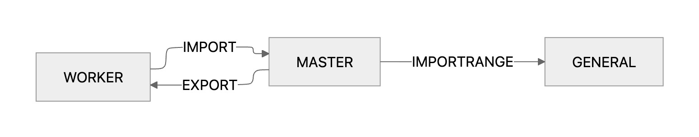<br>

- '부서별 시트 생성' 버튼을 만들면 종합 시트의 항목을 반복문으로 한 바퀴 돌아 그 부서명을 가진 파일을 새로 생성한다. 이 때, header가 필요한데, 처음엔 종합 시트를 복제하는 방식으로 했다가 버튼도 부서별 시트에 함께 복제되길래 TEMPLATE 시트를 하나 만들었다.
- 파일을 생성할 때 이메일 명단 시트를 확인하여 부서명으로 권한을 부여한다.
- '가져오기', '내보내기' 버튼을 만들고 관리자가 한 번씩 누른다.
- 집단 B를 위해 IMPORTRANGE를 사용하여 종합 시트를 참조하고 있는 파일 하나를 더 만들었다.

우선은 만들었는데 워킹은 되지만 사용자가 계속 버튼을 눌러주어야 해서 '실시간으로 연동' 측면에선 좀 아쉬운 시스템이었다.

<br><br>

여기까지 만들고나서 요청자에게 보여주며 대화를 해보니, 새로운 조건이 추가되었다.<br>

- B는 종합 시트를 보는 것 뿐만 아니라 수정도 가능해야 한다.
- 그리고 1년 이상 지속될 프로젝트이다.

<br><br>

~~B가 수정이 가능해야 한단 말을 처음부터 해주지 않은 요청자를 살짝 원망하며~~ 주말동안 계속 고민하다가 좋은 아이디어가 떠올랐다. 머릿속으로 곱씹어 봤는데 그 아이디어는 점점 확신으로 번져갔다. 오래 지속 가능한데다가, A보다 더 중요한 위치였던 집단 B에게 아주 최적인 구조였다. A와 C에게 약간의 번거로움(처음 사용할 때 접근 제한 허용과 사용 중에 버튼을 눌러 폼을 입력해서 데이터를 추가하는 방식)이 있지만 익숙해지면 아무 문제도 안될 정말 좋은 방법이라고 생각되었다.

<br><br>

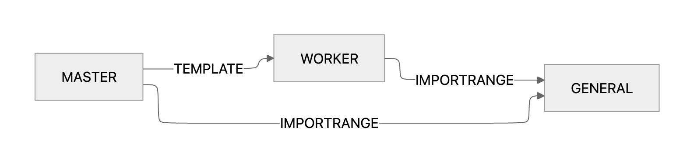<br>

| FILE NAME | DESCRIPTION |
| -- | -- |
| GENERAL | 집단 B가 보는 파일로, 데이터베이스가 되는 시트이다. 고로 자유롭게 수정이 가능하다. |
| MASTER | 집단 A가 보는 파일로, Report와 Settings 2가지의 시트가 있다.<br>[ Report ]<br>- IMPORTRANGE를 사용하여 GENERAL 파일의 Report 시트를 참조한다.<br>- 상단 'POST' 버튼을 눌러 폼이 담긴 모달창을 띄울 수 있다.<br>- 각 행의 A 열에 위치한 체크박스 하나를 선택한 후 'EDIT/DELETE' 버튼을 눌러 내용을 수정 또는 삭제할 수 있다.<br>- 폼이 담긴 모달창에서 'SAVE' 버튼을 누르면 GENERAL 파일의 시트에 내용이 추가/수정 된다.<br><br>[ Settings ]<br>- 부서명/이메일/담당자명을 입력한 후 오른쪽 상단에 위치한 'SYNC'를 누르면 부서명과 이메일이 채워져있는 경우에만 부서명으로 파일을 생성하면서 권한을 부여한다.<br>- 이메일을 지우면 자동으로 권한을 박탈한다. |
| TEMPLATE | MASTER 파일의 Settings 시트에서 'SYNC' 버튼을 누를 때 부서별 파일로 헤더와 스크립트를 제공하는 템플릿 파일이다. |
| WORKER | 'SYNC' 버튼을 누른 후 생성될 각 부서 파일로, 집단 C가 보게 된다. 해당하는 부서의 내용만 봐야하기 때문에 QUERY를 더한 IMPORTRANGE를 사용해 참조하고, 'POST', 'EDIT/DELETE' 버튼을 눌러 데이터를 제어할 수 있다. |

<br><br>

우선, 코어가 될 GENERAL 파일을 생성한 후 AppScript에 [코드를 작성](./GENERAL/Code.gs)한다.
<br>
C의 권한을 가진 사람에게는 GENERAL 파일이 보이지 않기 때문에, 웹앱으로 배포하여 스크립트를 실행해야 데이터를 추가할 수 있다.<br>

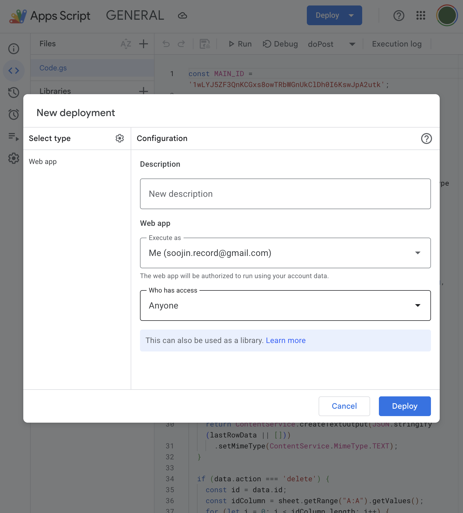<br>

<br>

ID가 존재하는 A열은 UX를 위해 숨겨두고, B열부터 K열까지 글자 하나라도 작성되면 자동으로 uuid를 기입한다. 내용이 사라지는 경우 자동으로 uuid를 삭제한다. 사용자의 입력을 감지하기 위해 on edit trigger를 설정한다.<br>

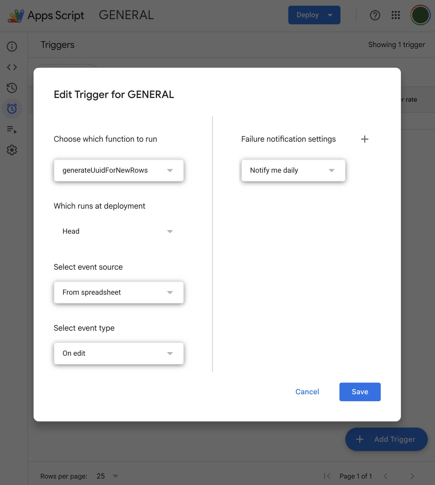<br>

이로써 GENERAL 파일의 설정은 끝났다.

<br><br>

다음, 관리자용인 MASTER 파일을 생성한 후 AppScript에 [코드를 작성](./MASTER/Code.gs)한다.
폼이 있는 모달창을 사용자에게 보여주기 위해 Index.html도 생성하여 [코드를 작성](./MASTER/Index.html)한다.<br>

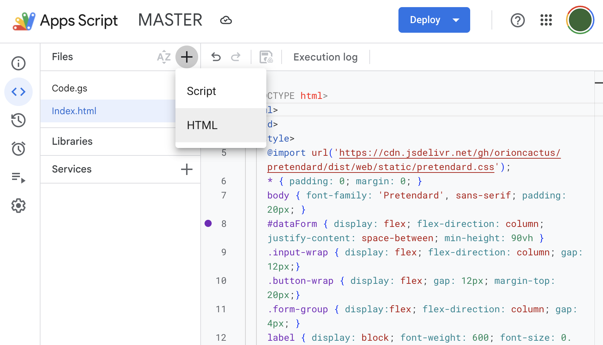<br>

사실 처음엔 EDIT/DELETE 버튼 없이 체크박스에다 트리거를 설정하여 체크박스를 누르면 바로 모달창이 뜨도록 구성했었다.

그러다보니 실행할 때마다 트리거가 새로 생성되었는데, 쌓여도 상관없나 싶었으나 아니나 다를까 잘 되다가 갑자기 오류가 발생했다. 트리거는 20개까지만 만들 수 있더라..

하는 수 없이 트리거를 생성하는 코드를 모두 제거하고 사용자가 체크박스를 선택한 후 EDIT/DELETE 버튼을 클릭하도록 UX를 바꾸었다. 실수로 체크박스를 누르는 경우도 있을 것이고 스크립트도 실행하기까지 조금의 대기 시간이 필요해서 오히려 이 방법이 더 사용자에게 좋은 경험이라 생각되었다.

이후, Report 시트에서 IMPORTRANGE 함수로 GENERAL 파일의 Report 시트를 참조한다.

```
=IMPORTRANGE("https://docs.google.com/spreadsheets/d/{your-database-file-id}/edit?gid=0#gid=0", "{your-database-sheet-name}!A6:K")
```
- A6:K는 Data range A6부터 K까지 헤더 부분이라 그 부분을 제외하고 가져온다는 것을 뜻한다.<br>

IMPORTRANGE 함수를 쓴 셀의 아래쪽에 사용자가 입력을 하려 시도하면, REF! 오류가 뜨게 된다. 때문에 사용자가 데이터를 보여주는 부분을 건드릴 수 없도록 설정했다. A열은 체크박스를 사용자가 제어할 수 있어야 하기 때문에 제외시킨다.<br>

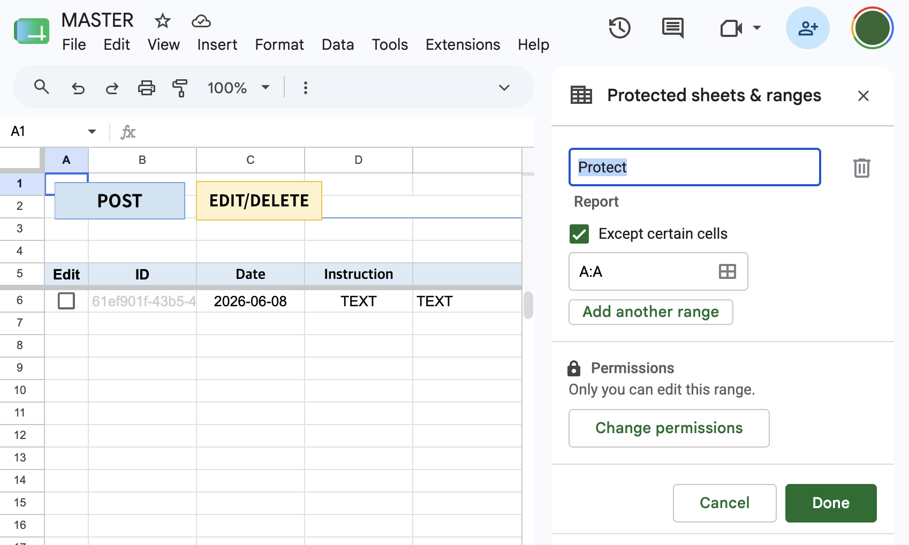<br>

추가로 사용성을 위해 스크롤할 때 헤더가 상단에 고정되도록 설정했다.<br>

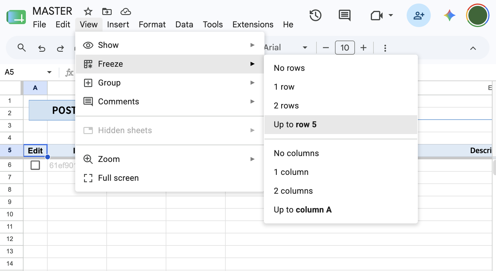<br>

Drawing에서 'POST', 'EDIT/DELETE' 버튼을 추가한다.<br>

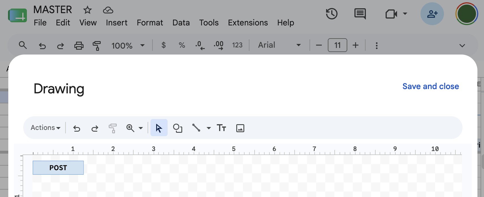<br>

<br>

오른쪽 마우스로 눌러 스크립트를 추가할 수 있다. 미리 만들어둔 addData 함수와 editData 함수를 추가한다.<br>

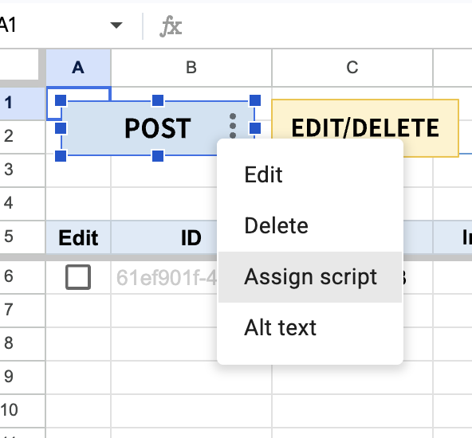<br>

<br>

A열에 체크박스를 삽입하고, 데이터가 있는 행만 체크박스가 보이도록 조건부 서식을 설정했다.

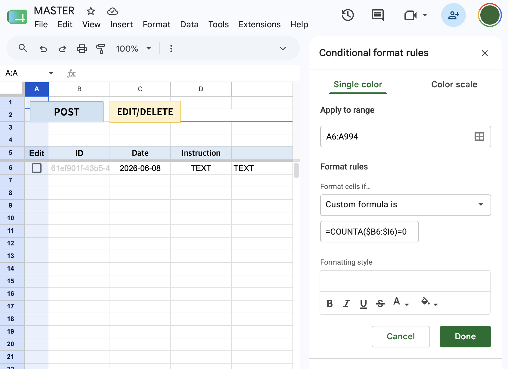<br>

여기까지, MASTER 파일의 설정은 끝이다.

<br><br>

마지막으로 부서별 시트의 제물이 될 TEMPLATE 파일만 남았다.

MASTER 파일을 그대로 복제하여 이름만 변경하고 Settings 시트를 삭제했다. 그리고 AppScript에서 [Settings 관련 코드만 삭제](./TEMPLATE/Code.gs) 하면 끝. MASTER 파일을 그대로 복제했기 때문에 Index.html도, 시트에서의 버튼도 똑같이 생성되어 따로 설정해줘야 할 건 없었다.

<br><br>

```
1. 권한 부여
    - [x]  권한 A로 변경
    - [x]  권한 B로 변경
    - [x]  권한 C로 변경
    - [x]  이메일 삭제 후 권한 박탈되는지 확인
2. UUID
    - [x]  GENERAL 파일의 Report 시트에서 새로운 행에 데이터를 입력한 후 자동 UUID 생성 확인
    - [x]  GENERAL 파일에 Report 시트에서 행 삭제 시 자동 UUID 제거 확인
3. 파일 생성 확인
    - [x]  SYNC 누른 후 부서별 파일 생성
    - [x]  IMPORTRANGE 연동 확인
4. 폼 테스트
    - [x]  POST 클릭 후 모달창 뜨는지 확인
    - [x]  모달에서 SAVE 클릭 후 데이터가 마지막 줄에 업데이트되는지 확인
    - [x]  체크박스를 선택하지 않은 경우와 여러 개 선택한 경우 얼럿창 뜨는지 확인
    - [x]  체크박스 > EDIT/DELETE 클릭 후 모달창 뜨는지 확인
    - [x]  내용 수정하고 SAVE 버튼 클릭 후 데이터가 업데이트되는지 확인
    - [x]  DELETE 클릭 후 데이터가 삭제되는지 확인
```

<br><br>

간단한 작동 테스트를 끝낸 후 버튼명과 에러메세지를 한글로 변경한 뒤, [가이드](https://app.notion.com/p/37d4d2a46ddf80ac8a46cd9d37916bae?source=copy_link) 를 만들어 전달했다.<br>

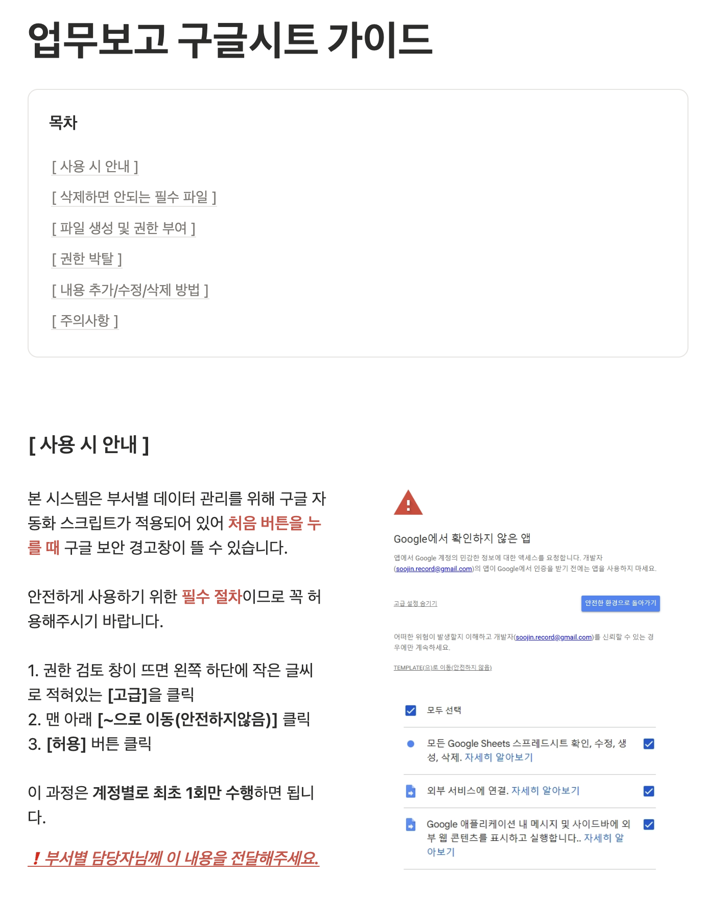<br>

미래에 언젠가 비슷한 일이 생긴다면 참고하기 좋을 것 같아 중요 내용을 제외하고 로직만 담은 [데모](https://drive.google.com/drive/folders/1pH1DCPGOVavkdxfdNSgcix_jYWs2b9Gy?usp=drive_link) 도 만들어보았다.

<br><br>


덧붙이는 글.<br>
조건이 꽤 복잡해보여서 처음엔 웹사이트로 하는 게 어떻겠냐 제안드렸더니, 꼭 구글 스프레드시트를 사용해야 한다고 해서 조금 어렵겠다 싶었는데 만족할 수 있는 결과물이 나와서 다행이었다.

만들고나니 구현보다는 어떤 방식으로 만들어야 할 지 고민에 할애한 시간이 더 많았던 것 같다. 설계할 때 AI랑 대화하다가 계속 같은 말만 하길래 질문이 잘못된건지 딱히 좋은 방도가 없는 것 같았다. 역시 풀리지 않는 문제에는 충분한 수면과 시원한 아침 샤워가 짱이다.

구글스프레드시트로 무언가 해본다는 생각은 못해봤었는데, 덕분에 이런 시스템 세팅으로 외주도 받는다는 사실도 알게 되었다. 몰랐던 시장을 발견한 느낌이라 새로웠다.