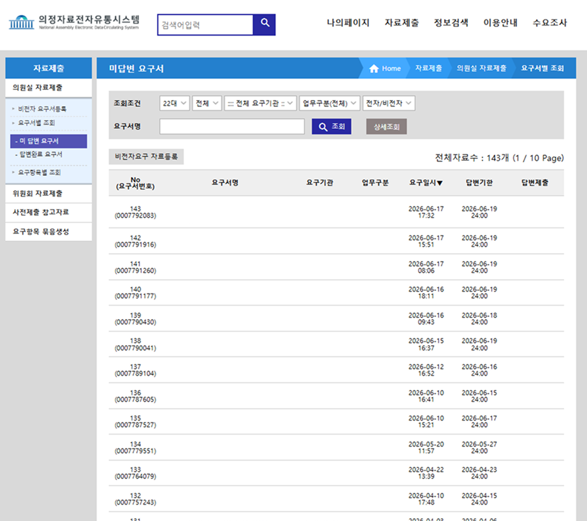
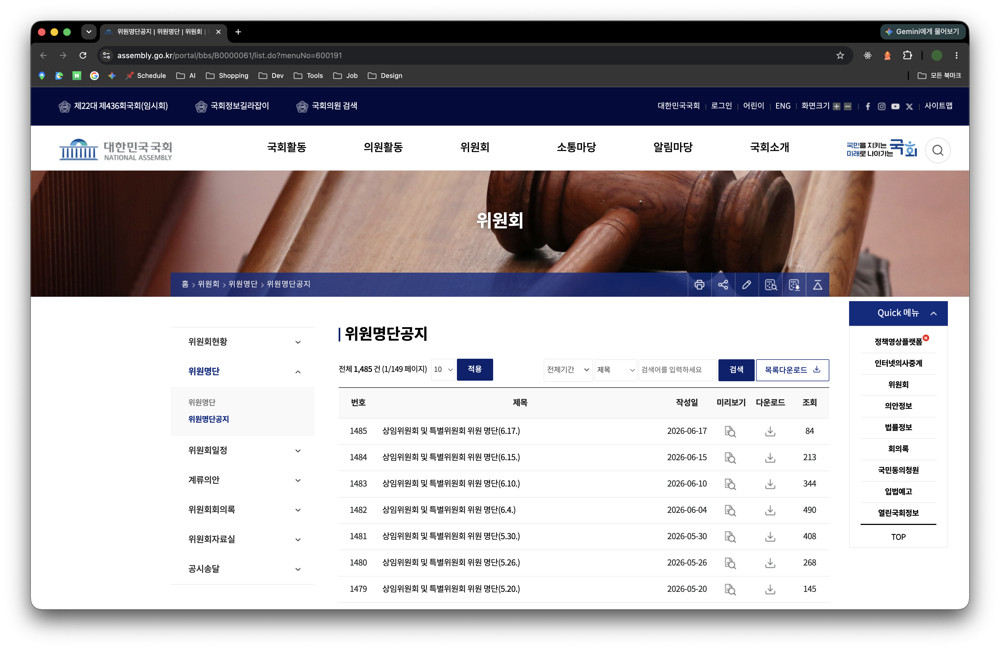
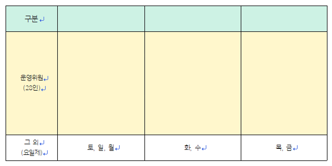
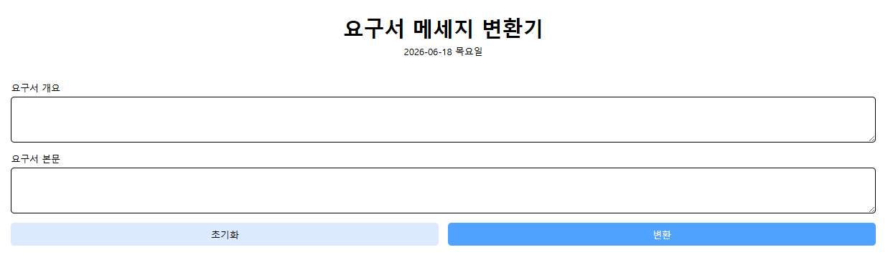
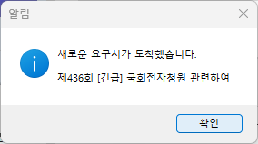
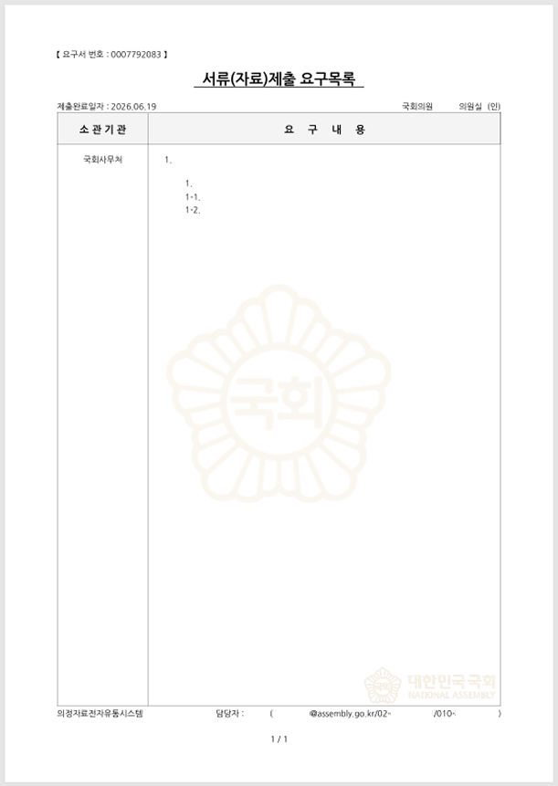
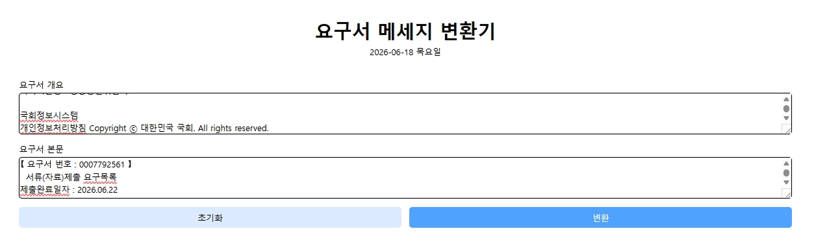
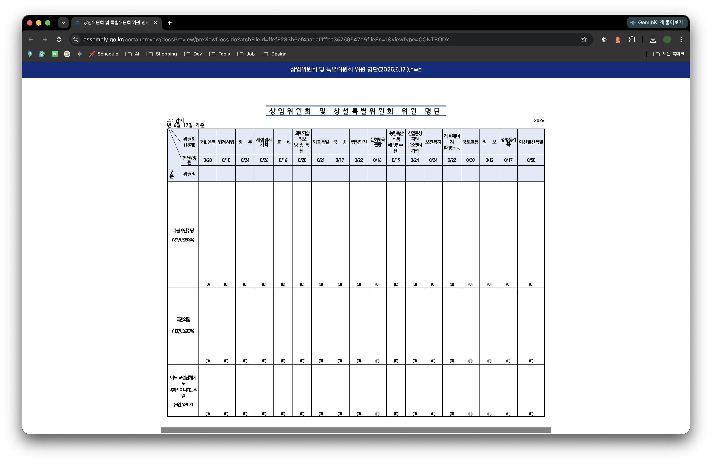

# 요구서 메세지 변환기

2026년 3월 10일, 입사한 지 일주일 정도 되었다. 사무보조로 입사한 터라 크게 어려운 업무가 주어지진 않았다. 항상 해야하는 업무 중 하나로 '의정자료전자유통시스템'에서 새로운 글이 올라오면 특정 메세지 양식으로 변경하여 카카오톡 그룹 채팅방에 올려야 하는 일이 있다. 내 손과 눈을 믿을 수가 없어 정확도를 올리기 위해 시스템을 만들겠다고 마음을 먹었다.

<br>

게시글을 확인하여 정해진 메세지의 양식으로 채팅을 보내기까지의 과정은 이렇다.

1. 언제 새로운 글이 올라오는지 알 수 없어 5~10분 주기로 새로고침을 한다.<br>
   
2. 의원의 소속을 확인하기 위해 [위원회 > 위원명단공지](https://www.assembly.go.kr/portal/bbs/B0000061/list.do?menuNo=600191) 에 게시된 내용을 참고한다.<br>
   
3. 운영회 소속인 경우 미리 전달 받은 담당표 프린트물을 보고 눈으로 대조하여 담당자를 찾는다.<br>
   <br>
4. 그 외 소속인 경우 '요구일시'를 기준으로 해당 요일의 담당자를 찾는다.
5. 위에서 찾아낸 위원회 소속과 담당자를 포함하여, 게시물 속에 기재된 답변기한과 내용을 정해진 메세지 양식으로 작성한다.

   ```
   # 메세지 양식
   {담당자명} 주무관님

   [{의원명} 의원({소속위원회})]

   {내용}

   답변기한 : {YYYY-MM-DD}
   ```

<br>

Python 스크립트로 '의정자료전자유통시스템' 창을 띄우고 5분 간격으로 새로고침하여 모니터링하고, 변환기 화면은 TypeScript와 React 그리고 Vite를 사용하기로 했다. 국회의원 소속을 매번 사이트에 접속해서 확인하는 번거로움을 없애기 위해 공공데이터포털 OPEN API를 찾아봤는데, 국회에도 OPEN API가 있다는 것을 알게 되었다. [국회의원 정보통합 API](https://open.assembly.go.kr/portal/data/service/selectAPIServicePage.do/OOWY4R001216HX11439) 를 무료로 사용할 수 있어 냉큼 신청했다.

<br>

전체 구조를 대략 표현하자면 이렇다.

```
.
├── scripts
│   └── monitor.py (감지용 핵심 스크립트)
└── src
    ├── App.tsx
    ├── api (국회 OPEN API와 통신)
    ├── components (UI)
    ├── constants (변경 가능성이 있는 정보들)
    ├── hooks (변환용 핵심 로직)
    ├── types (데이터 타입)
    └── utils (정규표현식, 메세지양식)
```

<br>

python 코드를 작성하기에 앞서, 내 자리의 컴퓨터가 어떤 환경인지 확인해볼 필요가 있었다. window이고, 주로 사용하는 브라우저는 microsoft edge였다. 처음 실행해봤을 때, 보안 때문인지 권한 문제가 있어서 창을 연 후 직접 인증서로 로그인하는 방식을 택하게 되었다.

<details>
<summary>scripts/monitor.py</summary>

```
from selenium import webdriver
from selenium.webdriver.edge.options import Options
from selenium.webdriver.common.by import By
import time
import tkinter as tk
from tkinter import messagebox

# CONFIG
TARGET_URL = "https://naps.assembly.go.kr:444/reqsubmit/10_mem/20_reqboxsh/10_make/SMakeReqBoxList.jsp?clickno=22"
CHECK_INTERVAL = 300 # 5분
TITLE_COLUMN_INDEX = 1 # 글 제목

# 안내창
def show_alert(title):
    root = tk.Tk()
    root.withdraw()
    root.attributes('-topmost', True)
    messagebox.showinfo("알림", f"새로운 요구서가 도착했습니다:\n\n{title}")
    root.destroy()

# 설정
options = Options()
options.add_argument("--disable-gpu")
options.add_argument("--no-sandbox")

driver = webdriver.Edge(options=options)
driver.get(TARGET_URL)

# 로그인 대기
time.sleep(60)

last_latest_title = ""

# 실행
def check_new_posts():
    global last_latest_title
    try:
        driver.refresh()
        time.sleep(3)

        table = driver.find_element(By.CSS_SELECTOR, "table.table.list.default.mb10")
        rows = table.find_elements(By.CSS_SELECTOR, "tbody > tr")

        if rows:
            cells = rows[0].find_elements(By.TAG_NAME, "td")
            if len(cells) > TITLE_COLUMN_INDEX:
                current_title = cells[TITLE_COLUMN_INDEX].text.strip()

                if last_latest_title != "" and current_title != last_latest_title:
                    show_alert(current_title)

                last_latest_title = current_title

    except Exception as e:
        print(f"Error: {e}")

# 무한 루프
while True:
    check_new_posts()
    time.sleep(CHECK_INTERVAL)
```

</details>

<br>

위 코드는 다음 명령어로 간단하게 실행시킬 수 있다.

```
py scripts/monitor.py
```

<br><br>

이제 변환기에서 사용할 상수들을 정의할 차례인데, 개인정보 보호를 위해 담당자명은 환경 변수로 처리한다. 그리고 소중한 OPEN API 키도 환경 변수에 적는다. 운영위원회 의원들이 대략 28명 정도 되는 것 같은데, 이건 그냥 CONSTANTS에 작성했다. 사실 모두 환경 변수로 작성하고 싶었는데, 매핑 때문에라도 둘 중 하나는 CONSTANTS로 작성해야 했다. ~~국회의원 이름은 뭐.. 괜찮지 않을까?~~

```
# 담당 주무관님 성함
VITE_ASSIGNEE_1=홍길동
VITE_ASSIGNEE_2=이영희
VITE_ASSIGNEE_3=김철수

# 국회 OPEN API Key
VITE_GOVERNMENT_API_KEY=YOUR_API_KEY_HERE
```

<br>

간단한 명령어로 개발 환경을 실행할 수 있다.

```
npm install
npm run dev
```



<br><br>

monitor.py를 실행시켜 인증서로 로그인하고, 변환기도 실행시켰으면 이제 그냥 기다리고 있다가 얼럿 창이 뜨면 목록을 확인하면 된다.

1. 얼럿 창이 뜨면 회사 컴퓨터의 마우스와 키보드에 손을 올린다.<br>
2. 아래 화면에서 `Ctrl + A`를 누른 다음 `Ctrl + C`로 모든 내용을 복사한다.<br>
   
3. 상단 ‘요구서 개요’ 부분에 `Ctrl + V`로 내용을 붙여넣는다.<br>
   
4. 아래 화면에서 `Ctrl + A`를 누른 다음 `Ctrl + C`로 모든 내용을 복사한다.<br>
   
5. ‘요구서 본문’ 부분에 `Ctrl + V`로 내용을 붙여넣는다.<br>
   
6. 이후, 변환 버튼을 누르면 결과물이 생성된다.<br>
   
7. 카카오톡 그룹 채팅방에 전송하면 끝!

<br><br>

덧붙이는 글.

- 2026-06-04 모든 의원의 소속을 찾을 수 없음<br>
  <br>
  어느날 계속 "소속된 위원회를 찾을 수 없습니다."라는 미리 설정해둔 에러메세지가 모든 의원한테 떠서 확인해보니, 소속된 위원회가 없는 의원이 있었다. 알고보니 국회의장이 바뀜에 따라 위원회 구성도 변경된다고.. 그래서 데이터 갱신 기간 동안 위원회 데이터를 받을 수 없던 거였다. 어쨌든 요구서는 계속 올라오고 나도 일은 해야하니 API 응답 없이도 사용할 수 있도록 오류 메세지 대신 '-'로 표기되도록 예외 처리하였다. 난 또 무슨 위 사진처럼 게시물이 올라와 있어 글 올리는 담당자가 실수로 내용 적는 걸 깜빡하고 그냥 업로드한 줄 알았다.
